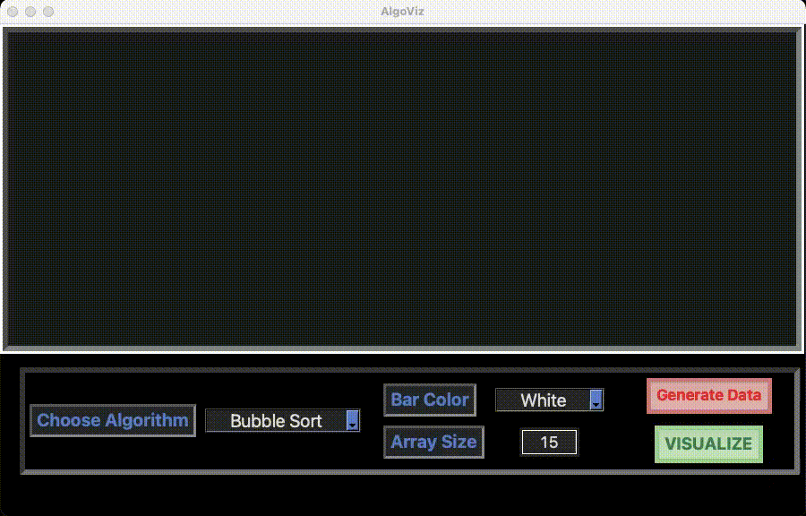

# AlgoViz
Visualizing Sorting and Searching algorithms made easy.



## Installation and Dependencies

1. [Python](https://www.python.org) Installed.

2. Just one module named 'colour' to be installed

- Open up Terminal/ Command Prompt and type in:

Windows Users
```bash
pip install colour
```

MacOS/ Linux Users
```bash
pip3 install colour
```

## Usage

Inside the Repository's directory, Open Terminal/ Command Prompt and type in:

- Windows Users
```bash
python visualizer.py
```

- MacOS/ Linux Users
```bash
python3 visualizer.py
```

## Note

- Kindly do not move, delete, rename or modify any files (unless you know what you are doing).
